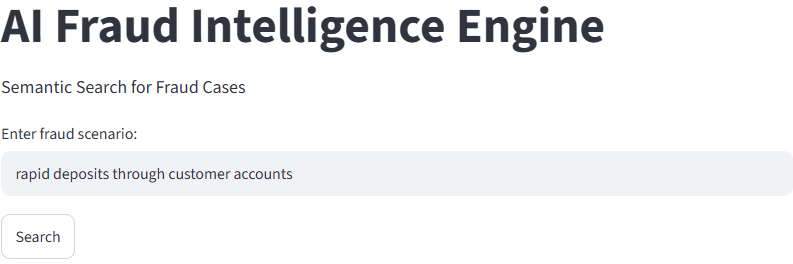
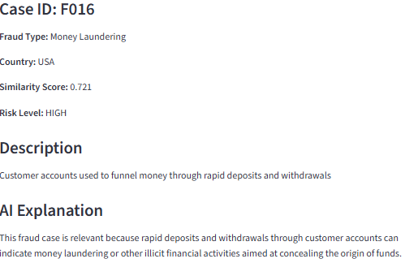
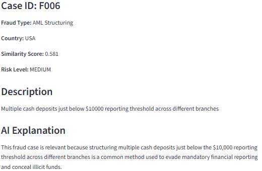
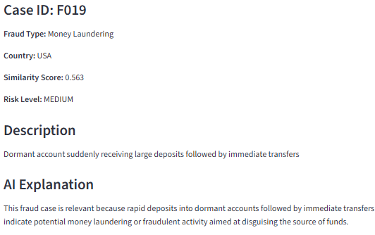

# AI Fraud Intelligence Engine

## Overview

The AI Fraud Intelligence Engine is a semantic search application that helps investigators identify historical fraud cases similar to a scenario under investigation.

Unlike keyword-based searches, this project uses vector embeddings and semantic similarity to identify cases that are conceptually similar, even when different words are used.

Example:

Investigator Query:

"rapid deposits through customer accounts"

## Aplication screenshots
### Home Page

The system can identify related cases involving:

* Money laundering
* Structuring
* Funnel accounts
* Rapid movement of funds

### Money Laundering Search

The application combines OpenAI embeddings, MongoDB Atlas, cosine similarity scoring, and AI-generated explanations within a Streamlit web interface.

## System Architecture 

## Workflow
* Investigator enters a fraud scenario.
* Streamlit captures the query.
* OpenAI converts the query into a vector embedding.
* MongoDB retrieves stored fraud case embeddings.
* Cosine similarity measures how closely cases match the query.
* The system ranks cases by similarity.
* Risk levels are assigned.
* AI-generated explanations are displayed.
---

## Tech Stack

### Python

Python serves as the primary programming language for the application.

Responsibilities:

* Data processing
* Embedding generation
* Similarity calculations
* OpenAI API integration
* Streamlit application development

### MongoDB Atlas

MongoDB Atlas is a cloud-hosted NoSQL database used to store fraud cases and their vector embeddings.

Responsibilities:

* Store fraud case records
* Store vector embeddings
* Retrieve historical cases during searches

Create a free account at:

https://www.mongodb.com/cloud/atlas

### OpenAI API

OpenAI provides the embedding model used to convert fraud narratives into numerical vectors.

Model used:

text-embedding-3-small

Responsibilities:

* Convert fraud descriptions into embeddings
* Convert investigator queries into embeddings
* Generate AI explanations for search results

Create an API key at:

https://platform.openai.com/

### Streamlit

Streamlit provides the web interface.

Responsibilities:

* Accept investigator queries
* Display search results
* Present risk scores and AI explanations

---

## Dataset

The project uses a synthetic fraud dataset containing:

* Expense Fraud
* Procurement Fraud
* Payroll Fraud
* Money Laundering
* AML Structuring
* Vendor Fraud

Dataset Location:

data/fraud_cases.json

Users may replace the dataset with:

* ACFE case studies
* FinCEN advisories
* World Bank sanctions cases
* SEC enforcement actions
* Internal Investigation Reports

---

## Project Structure

FraudProject/

├── app.py

├── search_engine.py

├── create_embeddings.py

├── requirements.txt

├── README.md

├── .gitignore

├── data/

│ └── fraud_cases.json

└── .env (local only)

---

## Installation

Clone the repository:

git clone <your_repository_url>

Install dependencies:

pip install -r requirements.txt

---

## MongoDB Setup

1. Create a MongoDB Atlas account.
2. Create a free cluster.
3. Create a database named:

Fraud_db

4. Create a collection named:

Cases

5. Import the dataset from:

data/fraud_cases.json

6. Add your IP address to the Atlas Network Access list.

---

## OpenAI Setup

* Create an OpenAI account.
* Generate an API key.
* Create a .env file in the project root and store the API Key in the .env file as below:

OPENAI_API_KEY=your_api_key_here

---

## Generate Embeddings

Run:

python create_embeddings.py

This script generates vector embeddings for all fraud cases and stores them in MongoDB.

This step only needs to be performed once.

---

## Run the Application

streamlit run app.py

---

## Example Searches

rapid deposits through customer accounts

fake travel receipts reimbursement

vendor created shell company

multiple deposits below reporting threshold

---

## Future Enhancements

* Fraud Typology Prediction
* MongoDB Vector Indexes
* Real ACFE Case Studies
* World Bank Sanctions Cases
* AML Detection Models
* Fraud Investigation Dashboard

---

## Author

Kofi Nkrumah Debrah, FCCA, CFE
Fraud & Risk Consultant
